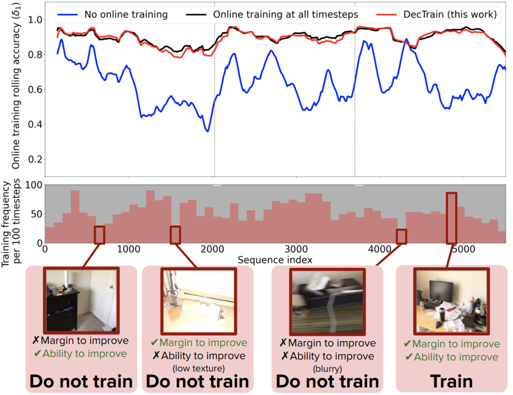

<h1 align="center">DecTrain: Deciding When to Train a Monocular Depth DNN Online </h1>

<p align="center">
    <strong>
        <a href = "https://scholar.google.com/citations?user=j8Z8zWMAAAAJ&hl=en">Zih-Sing Fu</a><sup>*</sup>,
        <a href = "https://scholar.google.com/citations?user=1oZrGb4AAAAJ&hl=en">Soumya Sudhakar</a><sup>*</sup>,
        <a href = "https://karaman.mit.edu/">Sertac Karaman</a>,
        <a href = "https://eems.mit.edu/principal-investigator-vivienne-sze/">Vivienne Sze</a>
    </strong>
    <br>
    <i><sup>*</sup>Equal Contribution</i>
    <br>
    <strong>
        <a href = "https://lean.mit.edu">MIT LEAN</a>
    </strong>
</p>

<p align="center"><strong>
    <a href = "https://ieeexplore.ieee.org/document/10857473">📄 [Paper]</a> |
    <a href = "https://lean.mit.edu/papers/dectrain">🌐 [Project]</a> <!-- |
    <a href = "">🎥 [Video]</a> -->
</strong></p>

<p align="middle">
  
</p>

This repo contains code to run DecTrain, an algorithm that decides when to train a monocular depth DNN, published in [our paper](https://ieeexplore.ieee.org/document/10857473).

## Installation
Clone this repo and copy over submodules to a specific path (e.g. `dectrain`) using
```bash
git clone https://github.com/soumya-ss/on_the_fly_learning.git dectrain
cd dectrain
git checkout code-release
git submodule update --init --recursive
```

This code was tested with Python 3.9 and PyTorch 2.0.0 on Ubuntu 20.04. To install the dependencies, create and activate a new virtual environment with Python 3.9, install PyTorch from source (https://pytorch.org/get-started/locally/), and install using `requirements.txt` for the rest of the dependencies into the virtual environment. 

```bash
python3 -m venv <path/to/venv> && source <path/to/venv>/bin/activate                             # create and activate virtual environment
pip3 install -r requirements.txt                                                                 # install required packages
pip3 install torch==2.0.0 torchvision==0.15.0 --index-url https://download.pytorch.org/whl/cu118 # install PyTorch 2.0.0
```
Last, apply patches to submodules for interfacing with our code:
```bash
bash scripts/apply_submodule_patches.sh
```

## Download pretrained models
Please find the pretrained monocular depth DNNs [here](https://drive.google.com/file/d/1xX1iWuWyD8JbrqCOjXCqiwitTLl-Sz9Z/view?usp=drive_link), and the pretrained decision DNNs [here](https://drive.google.com/file/d/1hJGhNJfPLnjLYYv5ZEMAbG4gZ2cOcHgU/view?usp=drive_link). Download and unzip the files to `dectrain/models/`.
```bash
mkdir models
unzip <path/to/depth_models.zip> -d models
unzip <path/to/decision_models.zip> -d models
```
The models should be seen in `dectrain/models/depth` and `dectrain/models/decision`.
The depth DNNs are pretrained on [NYUDepthV2](https://cs.nyu.edu/~fergus/datasets/nyu_depth_v2.html), and the decision DNNs are pretrained on our pre-collected statistics [here](https://drive.google.com/file/d/148MDW-8Lvz31qH-kiHL7FH_bZpjKS4vc/view?usp=drive_link).

## Download datasets
For online depth training, we use [ScanNet](http://www.scan-net.org/), [SUN3D](https://sun3d.cs.princeton.edu/), and [KITTI-360](https://www.cvlibs.net/datasets/kitti-360/) for our experimetns. Please download the datasets and create symbolic links in this repo.
```bash
mkdir -p datasets/depth
ln -s <path/to/scannet> datasets/depth/scannet
ln -s <path/to/sun3d> datasets/depth/sun3d
ln -s <path/to/kitti360> datasets/depth/kitti-360
```
For pretraining decision DNN, please download our pre-collected training data [here](https://drive.google.com/file/d/148MDW-8Lvz31qH-kiHL7FH_bZpjKS4vc/view?usp=drive_link). Follow the steps to save the files to `datasets/decision`
```bash
mkdir -p datasets
unzip <path/to/decision_dataset.zip> -d datasets
```
This dataset is also used for source replaying when running online decision DNN training. 
*Note: we are still working on cleaning up the code for bridging the raw depth dataset format to our framework's interface.*

## Setup configurations
We provide the config files used for our experiments in `configs/`. You can also download them from [here](https://drive.google.com/file/d/1LAwKkVX4qpnywntyAn22ZUdca3s4734k/view?usp=drive_link). `configs/decision-dnn` is for offline training the decision DNN, the other folders are all for online depth DNN training.

## Online depth DNN training
Please make sure to activate the virtual environment for this project. We provide an example script (`scripts/online_train_depth_dnn`) for running the online depth DNN training:
```
bash scripts/online_train_depth_dnn.sh
``` 
The script will run the online depth DNN training with the provided experiment configs, and run a compute estimation at the end of the training. The training results will be stored to `outputs/`.

## Offline decision DNN training
Please make sure to activate the virtual environment for this project. We provide a script (`scripts/offline_train_decision_dnn`) as example of training our decision DNN:
```
bash scripts/offline_train_decision_dnn.sh
``` 
The script train the decision DNN with our pre-collected online training statistics. To run your own online training statistics collection with a given config, please make sure the following configs are enabled:
```
acquisition_type: all
record_policy_training_data: true
record_policy_training_data_pattern: <list of 1/0, 1 is train, 0 is not train>
```

## Acknowledgement
This work is implemented based on many open-source projects, including [CoDEPS](https://github.com/robot-learning-freiburg/CoDEPS), [DinoV2](https://github.com/facebookresearch/dinov2), [TUM-RGBD tools](https://cvg.cit.tum.de/data/datasets/rgbd-dataset/tools) and [UfM](https://github.com/mit-lean/ufm). We greatly appreciate their awesome works!

## Citation
If you reference this work, please consider citing the following:
```
@article{ral2025dectrain,
  title={DecTrain: Deciding When to Train a Monocular Depth DNN Online},
  author={Fu, Zih-Sing and Sudhakar, Soumya and Karaman, Sertac and Sze, Vivienne},
  journal={IEEE Robotics and Automation Letters},
  year={2025},
  publisher={IEEE}
}
```